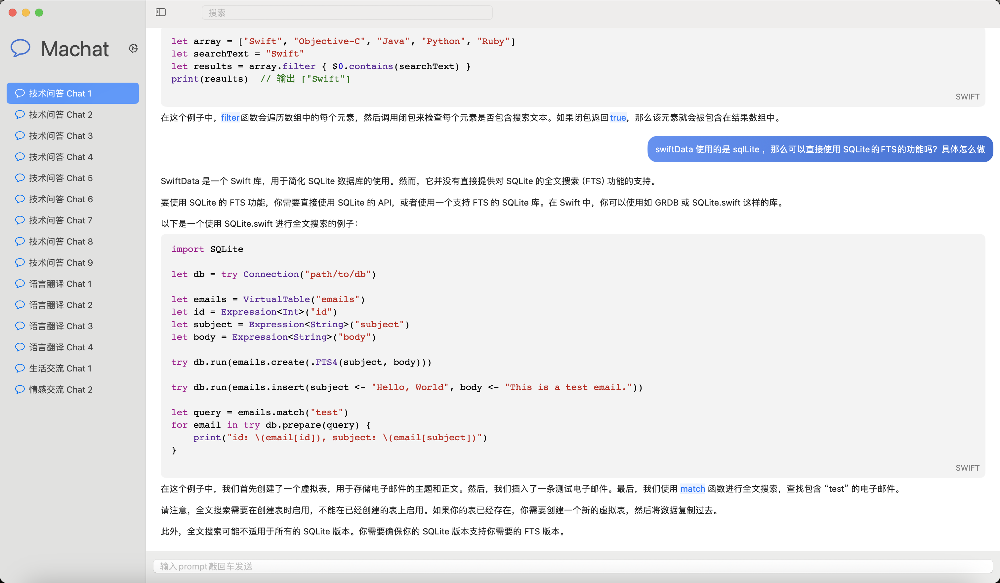

## Machat
又一个 chatgpt 客户端，支持 Macos 12+ ，采用 swiftUI 和 Realm 编写；markdown 采用原生渲染方式，目标是想做一款性能较好的工具

## TODO
- [x] 聊天功能
- [x] 会话管理(prompt、上下文)
- [x] 流式响应解析，打字效果渲染
- [x] 聊天存储
- [x] 关键字简单搜索
- [x] 输入框优化
- [x] 滚动体验优化
- [x] 数据清理等
- [ ] 全文搜索，定位，高亮文本
- [ ] 性能优化，分页查询
- [ ] 模型参数设置,model,maxToken
- [ ] 字体文本设置，界面美化
- [ ] 数据批量导出
- [x] 修复聊天框失去焦点会发送的bug
- [ ] 修复复制vscode代码到聊天框会乱码的bug

## Screenshot

